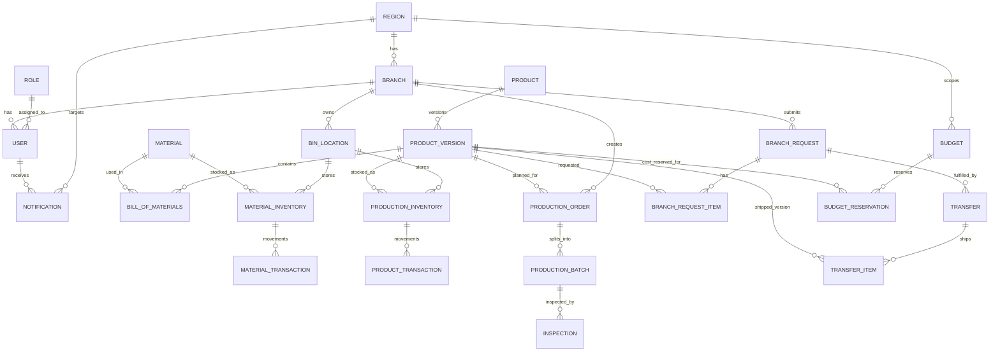

# ERP Frontend-Derived ERD (Pages, Triggers, Notifications, CRUD)

This ERD is inferred from `react-erp-frontend-main` frontend models/pages and API contracts.  
Use it as a **proposed logical schema** to align backend tables with current UI workflows.

## 1) Core Entities and Attributes

Legend:

- `PK` = Primary Key
- `FK` = Foreign Key
- `NN` = Not Null
- `UQ` = Unique

### 1.1 Organization and Access

#### `Region`

| Column     | Type         | Constraints | Notes                    |
| ---------- | ------------ | ----------- | ------------------------ |
| RegionID   | INT(10)      | PK, NN      | Region identifier        |
| RegionName | VARCHAR(100) | NN, UQ      | Region name              |
| IsActive   | BOOLEAN      | NN          | Active flag              |
| CreatedAt  | DATETIME     |             | Optional audit timestamp |

#### `Branch`

| Column     | Type         | Constraints               | Notes                      |
| ---------- | ------------ | ------------------------- | -------------------------- |
| BranchID   | INT(10)      | PK, NN                    | Branch identifier          |
| BranchName | VARCHAR(100) | NN                        | Branch/warehouse/site name |
| RegionID   | INT(10)      | FK -> Region.RegionID, NN | Region owner               |
| Location   | VARCHAR(160) |                           | Optional location label    |
| Address    | VARCHAR(255) |                           | Optional address           |
| IsActive   | BOOLEAN      |                           | Active flag                |
| CreatedAt  | DATETIME     |                           | Optional audit timestamp   |

#### `Role`

| Column      | Type         | Constraints | Notes             |
| ----------- | ------------ | ----------- | ----------------- |
| RoleID      | INT(10)      | PK, NN      | Role code         |
| DisplayName | VARCHAR(120) | NN          | Role display      |
| Scope       | VARCHAR(80)  | NN          | Role scope        |
| Description | TEXT         |             | Role description  |
| IsActive    | BOOLEAN      | NN          | Active flag       |
| CreatedAt   | DATETIME     | NN          | Created timestamp |

#### `User`

| Column          | Type         | Constraints               | Notes                                          |
| --------------- | ------------ | ------------------------- | ---------------------------------------------- |
| UserID          | INT(10)      | PK, NN                    | User identifier                                |
| BranchID        | INT(10)      | FK -> Branch.BranchID, NN | Assigned branch                                |
| RoleID          | INT(10)      | FK -> Role.RoleID, NN     | Role assignment (`RoleName` in UI)             |
| Username        | VARCHAR(100) | NN, UQ                    | Login/username                                 |
| Firstname       | VARCHAR(100) | NN                        | First name                                     |
| Middlename      | VARCHAR(100) | NN                        | Middle name                                    |
| Lastname        | VARCHAR(100) | NN                        | Last name                                      |
| PasswordHash    | VARCHAR(255) | NN                        | Backend-auth field (frontend sends `Password`) |
| IsActive        | BOOLEAN      |                           | Active flag                                    |
| CreatedByUserID | INT(10)      | FK -> User.UserID         | Self-reference for audit                       |

#### `RolePermissionChangeRequest`

| Column            | Type        | Constraints           | Notes                     |
| ----------------- | ----------- | --------------------- | ------------------------- |
| RequestID         | INT(10)     | PK, NN                | Change request id         |
| RoleID            | INT(10)     | FK -> Role.RoleID, NN | Target role               |
| BranchID          | INT(10)     | FK -> Branch.BranchID | Optional branch scope     |
| RequestedByUserID | INT(10)     | FK -> User.UserID, NN | Requestor                 |
| RequestedAt       | DATETIME    | NN                    | Request timestamp         |
| Status            | VARCHAR(40) | NN                    | Pending/Approved/Rejected |
| ReviewedByUserID  | INT(10)     | FK -> User.UserID     | Reviewer                  |
| ReviewedAt        | DATETIME    |                       | Review timestamp          |
| Notes             | TEXT        |                       | Review/request notes      |
| PayloadJSON       | JSON/TEXT   | NN                    | Proposed matrix payload   |

### 1.2 Master Data (PLM)

#### `Material`

| Column     | Type          | Constraints | Notes               |
| ---------- | ------------- | ----------- | ------------------- |
| MaterialID | INT(10)       | PK, NN      | Material id         |
| Name       | VARCHAR(180)  | NN          | Material name       |
| Type       | VARCHAR(80)   | NN          | Fabric/trim/etc     |
| Unit       | VARCHAR(20)   | NN          | Measurement unit    |
| UnitCost   | DECIMAL(10,2) | NN          | Unit price          |
| Status     | VARCHAR(40)   | NN          | Active/Archived/etc |

#### `Product`

| Column         | Type         | Constraints           | Notes                   |
| -------------- | ------------ | --------------------- | ----------------------- |
| ProductID      | INT(10)      | PK, NN                | Product id              |
| SKU            | VARCHAR(80)  | NN, UQ                | SKU                     |
| Name           | VARCHAR(180) | NN                    | Product name            |
| Category       | VARCHAR(80)  | NN                    | Category                |
| Description    | TEXT         | NN                    | Description             |
| Season         | VARCHAR(80)  | NN                    | Season/collection label |
| Status         | VARCHAR(40)  | NN                    | Product status          |
| ApprovalStatus | VARCHAR(40)  |                       | Optional approval flag  |
| BranchID       | INT(10)      | FK -> Branch.BranchID | Optional branch scope   |

#### `ProductVersion`

| Column               | Type          | Constraints                 | Notes                       |
| -------------------- | ------------- | --------------------------- | --------------------------- |
| VersionID            | INT(10)       | PK, NN                      | Version id                  |
| ProductID            | INT(10)       | FK -> Product.ProductID, NN | Parent product              |
| VersionNumber        | VARCHAR(50)   | NN                          | Version label               |
| ApprovalStatus       | VARCHAR(40)   | NN                          | Approval state              |
| BOMComplete          | BOOLEAN       | NN                          | BOM completeness            |
| StandardLaborCost    | DECIMAL(10,2) |                             | Optional                    |
| StandardOverheadCost | DECIMAL(10,2) |                             | Optional                    |
| ReleasedBudgetID     | INT(10)       | FK -> Budget.BudgetID       | Linked budget when released |
| ReleasedAt           | DATETIME      |                             | Release timestamp           |

#### `BillOfMaterials`

| Column      | Type          | Constraints                        | Notes                  |
| ----------- | ------------- | ---------------------------------- | ---------------------- |
| BOMID       | INT(10)       | PK, NN                             | BOM line id            |
| VersionID   | INT(10)       | FK -> ProductVersion.VersionID, NN | Product version        |
| MaterialID  | INT(10)       | FK -> Material.MaterialID, NN      | Material used          |
| QtyRequired | DECIMAL(10,2) | NN                                 | Required quantity      |
| Unit        | VARCHAR(20)   | NN                                 | Unit                   |
| UnitCost    | DECIMAL(10,2) | NN                                 | Cost basis at BOM time |

### 1.3 Finance

#### `Budget`

| Column               | Type          | Constraints           | Notes                                  |
| -------------------- | ------------- | --------------------- | -------------------------------------- |
| BudgetID             | INT(10)       | PK, NN                | Budget id                              |
| BudgetCode           | VARCHAR(80)   | NN, UQ                | Human-readable code                    |
| Name                 | VARCHAR(180)  | NN                    | Budget name                            |
| RegionID             | INT(10)       | FK -> Region.RegionID | Region-scoped budget (nullable if all) |
| AppliesToAll         | BOOLEAN       |                       | True when global                       |
| PeriodStart          | DATE          | NN                    | Start date                             |
| PeriodEnd            | DATE          | NN                    | End date                               |
| MaterialsBudget      | DECIMAL(10,2) | NN                    | Budget bucket                          |
| LaborBudget          | DECIMAL(10,2) | NN                    | Budget bucket                          |
| OverheadBudget       | DECIMAL(10,2) | NN                    | Budget bucket                          |
| WasteAllowanceBudget | DECIMAL(10,2) | NN                    | Budget bucket                          |
| TotalBudget          | DECIMAL(10,2) | NN                    | Computed/stored total                  |
| ReservedAmount       | DECIMAL(10,2) | NN                    | Reserved                               |
| SpentAmount          | DECIMAL(10,2) | NN                    | Spent                                  |
| RemainingAmount      | DECIMAL(10,2) | NN                    | Remaining                              |
| Status               | VARCHAR(40)   | NN                    | Draft/Pending/Approved/etc             |
| Notes                | TEXT          | NN                    | Notes                                  |
| RejectionReason      | TEXT          |                       | Rejection reason                       |
| CreatedByUserID      | INT(10)       | FK -> User.UserID, NN | Creator                                |
| SubmittedByUserID    | INT(10)       | FK -> User.UserID     | Submitter                              |
| SubmittedAt          | DATETIME      |                       | Submission time                        |
| ApprovedByUserID     | INT(10)       | FK -> User.UserID     | Approver                               |
| ApprovedAt           | DATETIME      |                       | Approval time                          |
| CreatedAt            | DATETIME      | NN                    | Audit                                  |
| UpdatedAt            | DATETIME      | NN                    | Audit                                  |

#### `BudgetReservation`

| Column              | Type          | Constraints                        | Notes                       |
| ------------------- | ------------- | ---------------------------------- | --------------------------- |
| BudgetReservationID | INT(10)       | PK, NN                             | Reservation id              |
| BudgetID            | INT(10)       | FK -> Budget.BudgetID, NN          | Budget                      |
| VersionID           | INT(10)       | FK -> ProductVersion.VersionID, NN | Product version             |
| MaterialAmount      | DECIMAL(10,2) | NN                                 | Material portion            |
| LaborAmount         | DECIMAL(10,2) | NN                                 | Labor portion               |
| OverheadAmount      | DECIMAL(10,2) | NN                                 | Overhead portion            |
| TotalAmount         | DECIMAL(10,2) | NN                                 | Reserved total              |
| RemainingAmount     | DECIMAL(10,2) | NN                                 | Remaining after reservation |
| Status              | VARCHAR(40)   | NN                                 | Reservation status          |

### 1.4 Warehouse, Production, Branch Operations

#### `BinLocation`

| Column   | Type          | Constraints               | Notes                   |
| -------- | ------------- | ------------------------- | ----------------------- |
| BinID    | INT(10)       | PK, NN                    | Storage bin id          |
| BranchID | INT(10)       | FK -> Branch.BranchID, NN | Owning branch/warehouse |
| BinCode  | VARCHAR(80)   | NN, UQ                    | Bin code                |
| Capacity | DECIMAL(10,2) | NN                        | Capacity                |
| Type     | VARCHAR(40)   | NN                        | Raw/Finished/etc        |

#### `MaterialInventory`

| Column         | Type          | Constraints                   | Notes                 |
| -------------- | ------------- | ----------------------------- | --------------------- |
| MatInvID       | INT(10)       | PK, NN                        | Material inventory id |
| BinID          | INT(10)       | FK -> BinLocation.BinID, NN   | Storage bin           |
| MaterialID     | INT(10)       | FK -> Material.MaterialID, NN | Material              |
| QuantityOnHand | DECIMAL(10,2) | NN                            | On hand qty           |

#### `MaterialTransaction`

| Column          | Type          | Constraints                          | Notes                |
| --------------- | ------------- | ------------------------------------ | -------------------- |
| MatTransID      | INT(10)       | PK, NN                               | Material movement id |
| MatInvID        | INT(10)       | FK -> MaterialInventory.MatInvID, NN | Target inventory row |
| UserID          | INT(10)       | FK -> User.UserID, NN                | Actor                |
| QtyChanged      | DECIMAL(10,2) | NN                                   | Quantity delta       |
| TransactionType | VARCHAR(40)   | NN                                   | Receive/Issue/etc    |
| TransactionDate | DATETIME      | NN                                   | Movement timestamp   |

#### `ProductionInventory`

| Column         | Type          | Constraints                        | Notes                       |
| -------------- | ------------- | ---------------------------------- | --------------------------- |
| ProdInvID      | INT(10)       | PK, NN                             | Finished goods inventory id |
| BinID          | INT(10)       | FK -> BinLocation.BinID, NN        | Bin                         |
| VersionID      | INT(10)       | FK -> ProductVersion.VersionID, NN | Product version             |
| QuantityOnHand | DECIMAL(10,2) | NN                                 | On hand qty                 |
| Status         | VARCHAR(40)   | NN                                 | Inventory status            |

#### `ProductTransaction`

| Column          | Type          | Constraints                             | Notes                |
| --------------- | ------------- | --------------------------------------- | -------------------- |
| ProdTransID     | INT(10)       | PK, NN                                  | Product movement id  |
| ProdInvID       | INT(10)       | FK -> ProductionInventory.ProdInvID, NN | Target inventory row |
| UserID          | INT(10)       | FK -> User.UserID, NN                   | Actor                |
| QtyChanged      | DECIMAL(10,2) | NN                                      | Quantity delta       |
| TransactionType | VARCHAR(40)   | NN                                      | Receive/Issue/etc    |
| TransactionDate | DATETIME      | NN                                      | Movement timestamp   |

#### `ProductionOrder`

| Column     | Type        | Constraints                        | Notes                         |
| ---------- | ----------- | ---------------------------------- | ----------------------------- |
| OrderID    | INT(10)     | PK, NN                             | Order id                      |
| BranchID   | INT(10)     | FK -> Branch.BranchID, NN          | Production branch             |
| VersionID  | INT(10)     | FK -> ProductVersion.VersionID, NN | Planned version               |
| PlannedQty | INT         | NN                                 | Planned output                |
| StartDate  | DATE        | NN                                 | Start date                    |
| Status     | VARCHAR(40) | NN                                 | Planned/In Progress/Completed |

#### `ProductionBatch`

| Column       | Type        | Constraints                       | Notes         |
| ------------ | ----------- | --------------------------------- | ------------- |
| BatchID      | INT(10)     | PK, NN                            | Batch id      |
| OrderID      | INT(10)     | FK -> ProductionOrder.OrderID, NN | Parent order  |
| BatchNumber  | VARCHAR(80) | NN, UQ                            | Batch code    |
| BatchQty     | INT         | NN                                | Produced qty  |
| ProducedDate | DATE        |                                   | Produced date |
| Status       | VARCHAR(40) | NN                                | Batch status  |

#### `Inspection`

| Column          | Type        | Constraints                       | Notes                |
| --------------- | ----------- | --------------------------------- | -------------------- |
| InspectionID    | INT(10)     | PK, NN                            | Inspection id        |
| BatchID         | INT(10)     | FK -> ProductionBatch.BatchID, NN | Inspected batch      |
| UserID          | INT(10)     | FK -> User.UserID, NN             | QA inspector         |
| AQLLevel        | VARCHAR(40) | NN                                | AQL level            |
| InspectionLevel | VARCHAR(40) | NN                                | Inspection level     |
| SampleSize      | INT         | NN                                | Sample size          |
| DefectsFound    | INT         | NN                                | Defects count        |
| AcceptThreshold | INT         | NN                                | Accept threshold     |
| RejectThreshold | INT         | NN                                | Reject threshold     |
| Result          | VARCHAR(40) | NN                                | Pass/Fail/etc        |
| Notes           | TEXT        |                                   | Notes                |
| InspectionDate  | DATETIME    |                                   | Inspection timestamp |

#### `BranchRequest`

| Column            | Type        | Constraints               | Notes                         |
| ----------------- | ----------- | ------------------------- | ----------------------------- |
| RequestID         | INT(10)     | PK, NN                    | Request id                    |
| BranchID          | INT(10)     | FK -> Branch.BranchID, NN | Requesting branch             |
| RegionID          | INT(10)     | FK -> Region.RegionID, NN | Request region                |
| RequestedByUserID | INT(10)     | FK -> User.UserID, NN     | Requestor                     |
| Status            | VARCHAR(40) | NN                        | Pending/Approved/Rejected/etc |
| RequestedAt       | DATETIME    | NN                        | Request timestamp             |
| Notes             | TEXT        |                           | Request note                  |

#### `BranchRequestItem`

| Column        | Type    | Constraints                        | Notes                     |
| ------------- | ------- | ---------------------------------- | ------------------------- |
| RequestItemID | INT(10) | PK, NN                             | Request line id           |
| RequestID     | INT(10) | FK -> BranchRequest.RequestID, NN  | Parent request            |
| VersionID     | INT(10) | FK -> ProductVersion.VersionID, NN | Requested product version |
| QtyRequested  | INT     | NN                                 | Quantity requested        |

#### `Transfer`

| Column        | Type        | Constraints                       | Notes                        |
| ------------- | ----------- | --------------------------------- | ---------------------------- |
| TransferID    | INT(10)     | PK, NN                            | Transfer id                  |
| RequestID     | INT(10)     | FK -> BranchRequest.RequestID, NN | Source request               |
| FromBinID     | INT(10)     | FK -> BinLocation.BinID, NN       | Source bin                   |
| ScheduledDate | DATE        | NN                                | Planned shipment date        |
| Status        | VARCHAR(40) | NN                                | Pending/In Transit/Delivered |
| DeliveredAt   | DATETIME    |                                   | Delivery timestamp           |

#### `TransferItem`

| Column         | Type    | Constraints                        | Notes            |
| -------------- | ------- | ---------------------------------- | ---------------- |
| TransferItemID | INT(10) | PK, NN                             | Transfer line id |
| TransferID     | INT(10) | FK -> Transfer.TransferID, NN      | Parent transfer  |
| VersionID      | INT(10) | FK -> ProductVersion.VersionID, NN | Version shipped  |
| QtyShipped     | INT     | NN                                 | Quantity shipped |

#### `RestockRequest` (frontend demo/local-storage)

| Column           | Type         | Constraints | Notes                     |
| ---------------- | ------------ | ----------- | ------------------------- |
| RestockRequestID | INT(10)      | PK, NN      | 10-digit request id       |
| SKU              | VARCHAR(80)  | NN          | Product sku               |
| Category         | VARCHAR(80)  | NN          | Category                  |
| Size             | VARCHAR(40)  | NN          | Size                      |
| RequestedQty     | INT          | NN          | Quantity requested        |
| Priority         | VARCHAR(20)  | NN          | Critical/High/Medium      |
| Note             | TEXT         | NN          | Request note              |
| RequestedAt      | DATETIME     | NN          | Request time              |
| RequestedBy      | VARCHAR(120) | NN          | Requestor display         |
| BranchName       | VARCHAR(160) | NN          | Branch display            |
| OnHand           | INT          | NN          | On hand at trigger time   |
| ReorderLevel     | INT          | NN          | Threshold at trigger time |
| Status           | VARCHAR(40)  | NN          | Pending/In Review/etc     |
| TargetRole       | VARCHAR(40)  | NN          | `Admin` in current UI     |

#### `ReceivingRecord` (frontend demo/local-storage)

| Column          | Type         | Constraints | Notes                               |
| --------------- | ------------ | ----------- | ----------------------------------- |
| ReceivingID     | INT(10)      | PK, NN      | 10-digit receive id                 |
| TransferRef     | VARCHAR(80)  | NN          | Transfer reference                  |
| SKU             | VARCHAR(80)  | NN          | Product sku                         |
| QtyDispatched   | INT          | NN          | Expected/dispatched qty             |
| ETA             | DATE         | NN          | Expected arrival                    |
| SourceWarehouse | VARCHAR(160) | NN          | Source warehouse name               |
| Status          | VARCHAR(40)  | NN          | Ready/Incoming/Received/Discrepancy |
| Priority        | VARCHAR(20)  | NN          | Critical/High/Medium                |
| DamagedUnits    | INT          | NN          | Damaged quantity                    |
| MissingUnits    | INT          | NN          | Missing quantity                    |
| Note            | TEXT         | NN          | Discrepancy note                    |

### 1.5 Notifications and Timeline

#### `Notification`

| Column         | Type        | Constraints           | Notes                         |
| -------------- | ----------- | --------------------- | ----------------------------- |
| NotificationID | INT(10)     | PK, NN                | Notification id               |
| UserID         | INT(10)     | FK -> User.UserID     | Direct user target (optional) |
| RegionID       | INT(10)     | FK -> Region.RegionID | Region target (optional)      |
| Type           | VARCHAR(40) | NN                    | Alert/System                  |
| Message        | TEXT        | NN                    | Notification content          |
| IsRead         | BOOLEAN     | NN                    | Read flag                     |
| CreatedAt      | DATETIME    | NN                    | Created timestamp             |

## 2) Cardinalities (Main Relationships)

- `Region (1) -> (1 to Many) Branch`
- `Branch (1) -> (1 to Many) User`
- `Role (1) -> (1 to Many) User`
- `Role (1) -> (1 to Many) RolePermissionChangeRequest`
- `User (1) -> (1 to Many) RolePermissionChangeRequest` (requested/reviewed)
- `Product (1) -> (1 to Many) ProductVersion`
- `ProductVersion (1) -> (1 to Many) BillOfMaterials`
- `Material (1) -> (1 to Many) BillOfMaterials`
- `Region (1) -> (1 to Many) Budget` (optional scope)
- `Budget (1) -> (1 to Many) BudgetReservation`
- `ProductVersion (1) -> (1 to Many) BudgetReservation`
- `Branch (1) -> (1 to Many) BinLocation`
- `BinLocation (1) -> (1 to Many) MaterialInventory`
- `Material (1) -> (1 to Many) MaterialInventory`
- `MaterialInventory (1) -> (1 to Many) MaterialTransaction`
- `BinLocation (1) -> (1 to Many) ProductionInventory`
- `ProductVersion (1) -> (1 to Many) ProductionInventory`
- `ProductionInventory (1) -> (1 to Many) ProductTransaction`
- `Branch (1) -> 1 to Many ProductionOrder`
- `ProductVersion (1) -> 1 to Many ProductionOrder`
- `ProductionOrder (1) -> 1 to Many ProductionBatch`
- `ProductionBatch (1) -> 1 to Many Inspection`
- `Branch (1) -> 1 to Many BranchRequest`
- `BranchRequest (1) -> 1 to Many BranchRequestItem`
- `ProductVersion (1) -> 1 to Many BranchRequestItem`
- `BranchRequest (1) -> (0..N) Transfer`
- `Transfer (1) -> 1 to Many TransferItem`
- `User (1) -> 1 to Many Notification` (optional direct target)
- `Region (1) -> 1 to Many Notification` (optional scoped target)

## 3) Trigger and Notification Mapping (From Frontend Workflows)

- **Low stock trigger**: Inventory low-level action creates `RestockRequest` and/or `BranchRequest`.
- **Admin decision trigger**: approve/reject changes `BranchRequest.Status`, reflected in tracker/queue pages.
- **Production trigger**: `Start Run` creates/updates `ProductionOrder` state and scheduler sync.
- **Batch trigger**: create batch inserts `ProductionBatch`; QA submission inserts `Inspection` and updates batch status.
- **Warehouse trigger**: receive/issue updates `MaterialInventory` or `ProductionInventory`, then inserts corresponding transaction row.
- **Delivery trigger**: scheduling/delivery updates request lifecycle and transfer state.
- **Realtime notifications**: event handlers map to `Notification` entries and toast/bell updates:
  - production updated
  - batch status changed
  - inventory alert
  - request created/approved/rejected
  - delivery scheduled/delivered
  - backorder created
  - budget submitted/approved
  - product released

## 4) CRUD Coverage by Key Pages (Frontend)

- `Super Admin > User Management`: `User` CRUD (create/update/archive/restore)
- `Super Admin > Branch & Warehouse Management`: `Region`, `Branch`, `BinLocation` CRUD
- `PLM > Material List`: `Material` CRUD
- `PLM > Products & Sizes`: `Product` CRUD
- `PLM > BOM Builder`: `BillOfMaterials` CRUD-like operations
- `Finance > Budget Planner / Submission`: `Budget` create/update/submit/approve/reject
- `Admin > Approval Inbox / Restock Queue`: approval transitions for `BranchRequest`, role change requests, and release workflows
- `Production > Queue / Batch / QA`: `ProductionOrder`, `ProductionBatch`, `Inspection`
- `Branch > Inventory / Restock Request / Tracker / Receiving`: request creation, status tracking, and stock-in confirmation (`RestockRequest`, `BranchRequest`, `ReceivingRecord`)
- `Topbar Bell / Notification Center`: `Notification` list/create/mark-read

## 5) Mermaid ERD (Quick Visual)

---

If you want, I can generate the **physical SQL DDL** next (MySQL or SQL Server) directly from this ERD.
